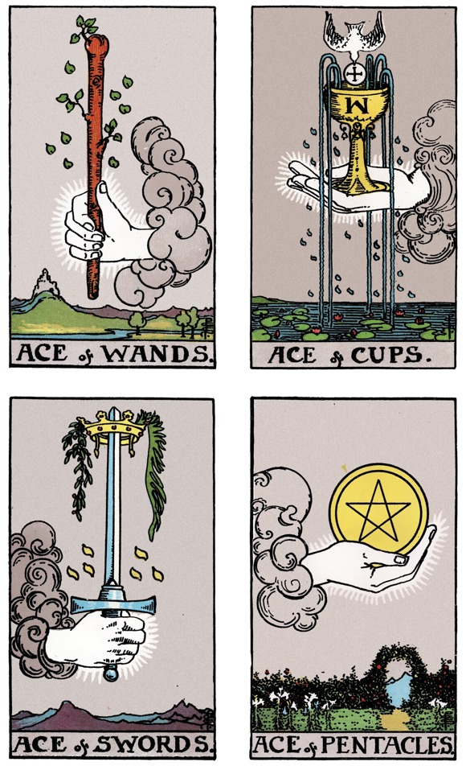
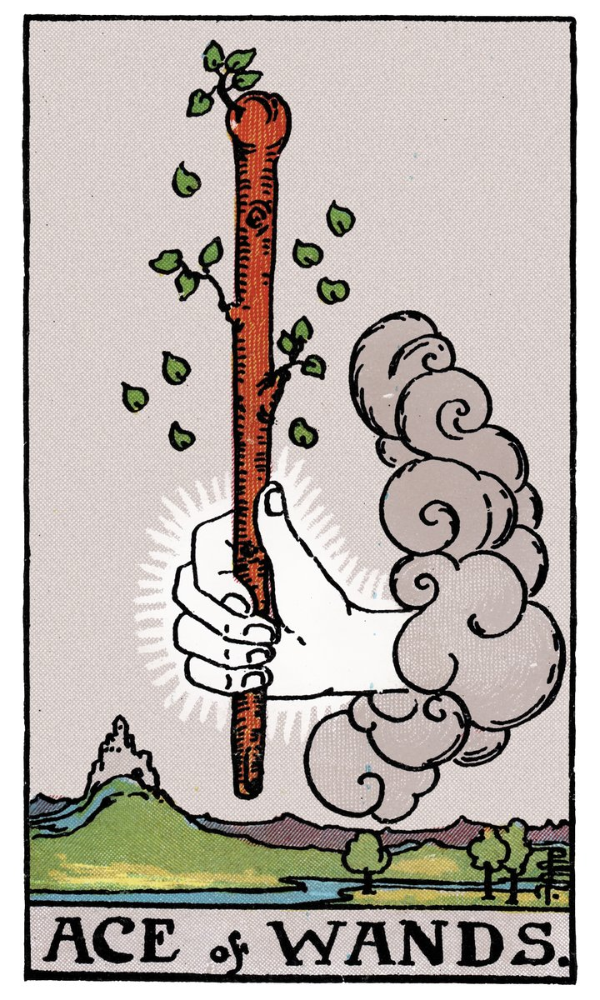
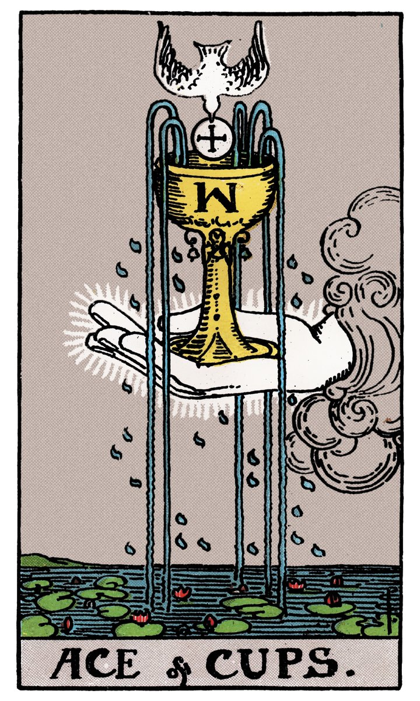
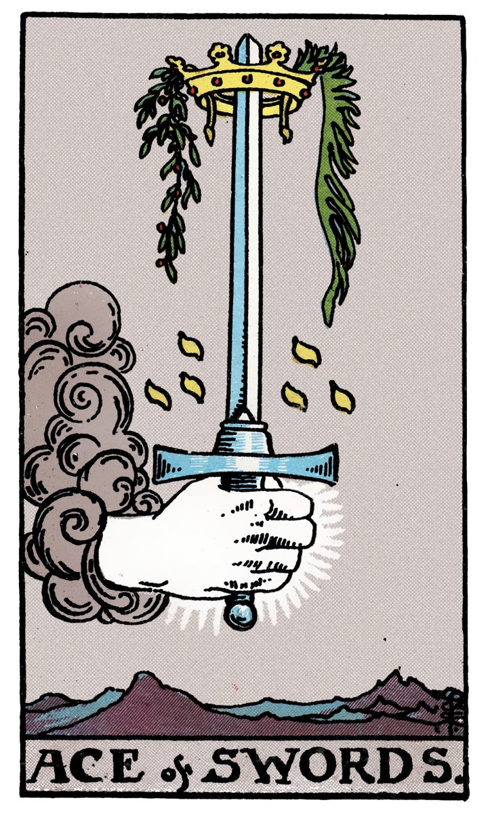
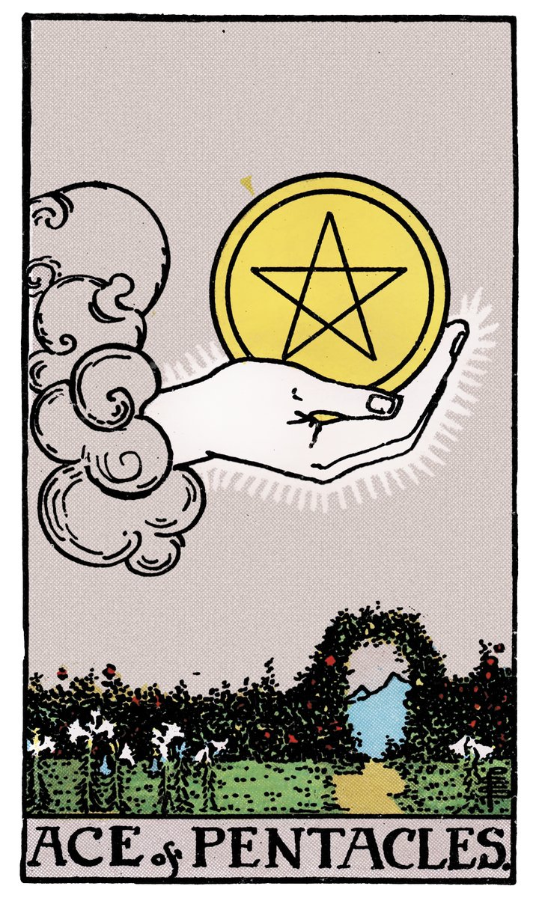

# 模块二｜认识你的牌

---

## 你的牌，不只是78张纸

打开盒子的时候，你可能会先注意到那块黑色绒面桌布，和那个束口牌袋。先别急着拆牌，我们花一分钟聊聊这两个配件。

**桌布不只是为了保护牌。** 它是一种"空间划定"——铺开桌布的那一刻，你在桌上划出了一块专属于你和牌的对话区域。以后每次练习，铺桌布这个动作本身就会成为进入状态的信号。

**牌袋也不只是为了收纳。** 把牌装进牌袋，是一个"关上对话"的动作。一次抽牌练习结束了，牌回到袋子里，你和它的这次对话告一段落。这个仪式感，比你想象中更重要。

好了，现在把牌拿出来，握在手里。感觉一下它的大小、厚度、纸张的质感。这78张牌，从今天开始就是你的了。

---

## 78张牌的骨架：大阿尔卡纳 + 小阿尔卡纳

塔罗牌一共78张，分成两个层级。这个结构本身就是一套世界观。

### 大阿尔卡纳：22张"人生主题"

"阿尔卡纳"这个词来自拉丁语 *arcanum*，意思是"奥秘"或"秘密"。大阿尔卡纳一共22张，从0号"愚人"到21号"世界"。

你可以把这22张牌理解为一趟旅程：从一张白纸出发（愚人），经历相遇、抉择、挑战、迷失、觉醒，最终抵达完整（世界）。每一张大牌，代表的是人生中一个阶段性的主题——不是今天中午吃什么，而是"我正处于一个什么样的生命阶段"。

> *0号牌「愚人」—— 大阿尔卡纳的第一张。一个年轻人站在悬崖边，手里拿着一朵白玫瑰，脚边跟着一只小狗。他望着天空，对脚下的深渊毫不在意。这不是"愚蠢"，而是每个人出发时的样子：不知道前方有什么，但愿意迈出第一步。*

这22张牌的编号不是随便排的。从0到21，每一张牌都在讲述旅程中的一段——从愚人的天真出发，经历魔术师的创造、女祭司的内省、恋人的选择、死神的放手、高塔的崩塌、星星的希望……最终抵达世界的完整。以后你在练习中会慢慢熟悉每一张，现在不用记。

### 小阿尔卡纳：56张"日常情境"

如果说大阿尔卡纳是22个生命主题，那小阿尔卡纳就是日常生活的56个切片。

小阿尔卡纳分成四个牌组，每个牌组14张（从1到10，再加4张宫廷牌）。这四个牌组对应四种元素：

| 牌组 | 对应元素 | 代表领域 | 常见象征物 |
|------|----------|----------|------------|
| 权杖 🪄 | 火 🔥 | 行动、热情、创造力 | 火焰、棍棒、植物 |
| 圣杯 🏆 | 水 💧 | 情感、直觉、关系 | 杯子、水流、鱼 |
| 宝剑 ⚔️ | 风 🌬️ | 思维、判断、沟通 | 刀剑、云、鸟 |
| 星币 🪙 | 土 🪨 | 物质、身体、实际成果 | 金币、五角星、大地 |

> **快速记忆技巧：** 不用背。你只需要记住一句话——"火行动，水感情，风思考，土物质"。以后看到一张小牌，先看它的牌组符号，就知道它大致在说哪个领域的事。

来看看四元素牌组各自长什么样。以下四张分别是权杖、圣杯、宝剑、星币的1号牌——每个牌组的起点：

 
 

观察一下这四张牌的视觉语言：

- **权杖王牌（火）：** 从云中伸出一只手，握着一根正在发芽的权杖。画面充满动感和生命力——这就是"行动"的能量。
- **圣杯王牌（水）：** 一只精致的圣杯被云朵托举，杯口溢出五道水流。画面宁静、丰沛——这就是"情感"的流动。
- **宝剑王牌（风）：** 一只手持利剑高举，剑尖顶着王冠，周围是山脉和云。画面锐利、清醒——这就是"思维"的穿透力。
- **星币王牌（土）：** 一只巨手托着一枚金币，下方是繁花盛开的花园。画面稳定、富足——这就是"物质"的根基。

### 宫廷牌：人物性格的16种面貌

每个牌组里有4张宫廷牌：侍从、骑士、王后、国王。你可以把它们理解为人格的不同面向——可能是你自己某个时刻的样子，也可能是你生活中遇到的某类人。现在先不展开，后面练习中你自然会感受到它们。

---

## 一眼认出来：大牌 vs 小牌

翻牌的时候，你可能会想快速分辨"这是一张大牌还是小牌"。其实不需要任何知识，看一眼就能分出来：

| 特征 | 大阿尔卡纳 | 小阿尔卡纳 |
|------|-----------|-----------|
| 画面 | 丰富的场景、多个人物、复杂背景 | 相对简洁、符号化 |
| 编号 | 牌面顶部或底部有罗马数字（0-XXI） | 牌面有数字+花色符号 |
| 牌名 | 英文牌名写在底部（如 THE FOOL） | 通常只写数字和花色（如 ACE of WANDS） |
| 感觉 | 像一幅完整的画 | 像一个特写镜头 |

翻一遍你的牌，按"大牌"和"小牌"分成两叠。感觉一下：大牌给你的整体感觉，和小牌有什么不同？不需要用语言表达，就感受一下。

---

## 洗牌仪式：你不需要任何"正确"的方法

网上有很多关于"如何正确洗塔罗牌"的说法：必须用左手、不能让别人碰、要顺时针洗七次……这些说法没有任何一条是"必须"的。

你可以像洗扑克牌一样洗。可以摊在桌上画圈搅乱。可以从中间切牌。可以在手里一张一张地翻。

唯一重要的原则是：**你在洗牌的时候，脑子里在想你要问的问题。** 洗牌不是"让牌变干净"（虽然仪式感上你可以这么理解），而是让你自己进入状态——你的手在做一件事，你的注意力在另一件事上。这种"手忙脑静"的状态，就是塔罗最好的准备状态。

试试看：把牌握在手里，心里想着模块一练习里你写下的那个问题，然后洗牌。不用想"我洗得对不对"，就自然地洗，洗到你觉得"差不多了"就停。

---

## 练习｜完成一次"开箱仪式"

这不是一个需要"做对"的练习，而是一个体验。步骤如下：

1. **铺好桌布**——选一个干净平整的桌面，把桌布铺开
2. **取出牌**——从牌盒里把78张牌拿出来，放在桌布上
3. **用手掌感受牌的厚度**——闭上眼睛，手放在牌堆上，心里默念一遍你模块一写下的那个问题
4. **分牌**——翻开牌，按"大牌"和"小牌"分成两叠。看一眼每张大牌的画面，不用记，就感受
5. **洗牌**——把牌合起来，用你觉得最自然的方式洗牌，不用数次数，洗到感觉"到了"就停
6. **收牌入袋**——把牌整理好，装进牌袋，拉紧束口绳

整个过程大概5-10分钟。做完以后，如果你愿意，可以拍一张"开箱照"发到小红书或抖音。不需要露脸，拍桌布+牌袋+牌的局部就好。带上话题 **#塔罗自学日记**，你的第一条自然传播素材就有了。

---

> **下个模块预告：** 你已经有了一张牌、一个问题、和一次"仪式感"。接下来我们要进入这套教程最核心的方法——**关键词联想法**。不背书，不查字典，让你用自己的眼睛去读牌。
