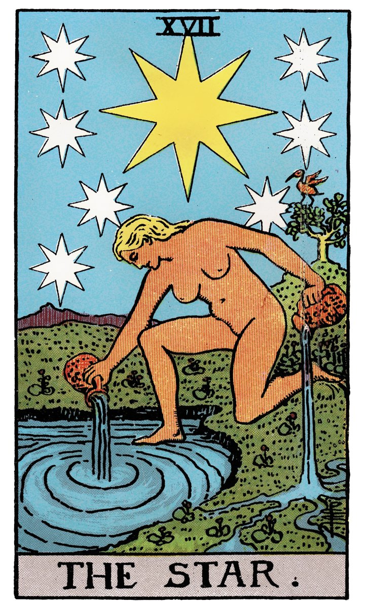

# 模块三｜关键词联想法

---

## 新手最大的痛点：记不住牌意

学塔罗的人，十个有九个卡在同一个地方——翻开一张牌，脑子里一片空白，然后下意识地想去翻书查"标准牌意"。

这不是你的问题。市面上大多数塔罗教程，本质上都是把78张牌的"标准牌意"列给你，然后让你像背英语单词一样去记忆。问题是，任何一张塔罗牌都没有唯一的标准答案。同一张"高塔"，在不同的问题里、不同的位置、面对不同的人，可能意味着"解放""崩溃""觉醒""突如其来"——你背哪个？

更根本的是：**塔罗从来就不是一个"查字典"的工具。** 它是一个"看图说话"的工具。从15世纪到今天，它之所以能跨越语言和文化的界限流传下来，不是因为每张牌有一句固定的"定义"，而是因为它的图像足够丰富、足够开放，让每一个看它的人都能看出不同的东西。

**关键词联想法**，就是教你重新学会"看图说话"。

---

## 你天生就会读图

先做一个实验。随便从牌堆里抽出一张牌，不要看书，不要查任何资料，就看牌面。问自己三个问题：

1. **这张画面上的人在做什么？** ——站着还是坐着？面向你还是背对你？一个人在还是一群人在？
2. **这张画的颜色给你什么感觉？** ——暖色调还是冷色调？明亮还是昏暗？有没有特别跳的颜色？
3. **如果用一个词来形容这张画，你会用什么词？**

你给出的那个词，就是你对这张牌的**第一直觉关键词**。它不需要和任何"标准牌意"吻合。它只需要是你真实看到的、真实感觉到的。

这就是关键词联想法的核心：**你的直觉比任何书都管用。** 你要相信，塔罗牌画面上的一切——人物的姿态、背景的颜色、构图的疏密——都是被设计来触发你直觉的。你不需要"学"怎么看，你只需要允许自己去看。

---

## 三个维度：姿态、颜色、数字

当然，直觉需要一些"抓手"——不能每次都干瞪眼看画。下面给你三个具体的观察维度，每次翻开一张牌，从这三个角度切入，几乎一定会蹦出一个词。

### 维度一：人物的姿态

先看牌上有没有人物。如果有，观察这个人的姿态：

- **站着还是坐着？** 站着通常意味着行动、力量、主动性；坐着意味着思考、等待、被动接受。
- **面朝哪个方向？** 面向你——这件事和"你"直接相关；背对你——可能你在逃避什么，或者这件事还没准备好被你看到。
- **手上在做什么？** 举着什么东西？指向某个方向？握紧拳头还是摊开手掌？
- **眼神看哪里？** 直视前方？低头？闭眼？看向远方？

> **举个例子：** 翻开一张牌，画面上一个穿着长袍的人站在悬崖边，手里拿着一根棍子，望向远方。你不需要知道这是"愚人牌"，你只需要想：一个人站在悬崖边上，他不知道前方是什么，但他看起来很放松，甚至有点期待。你的关键词可能是——"出发"、"冒险"、"不管不顾"、"新的开始"。任选一个，它就是你的第一直觉。

### 维度二：颜色的情绪

颜色是人类最原始的信号系统。红色是警报，蓝色是平静，黄色是阳光。塔罗牌面上的颜色不是随便涂的，每一块颜色都在传递情绪：

- **大量黄色/金色：** 活力、意识觉醒、智力、光明
- **大量蓝色：** 平静、沉思、直觉、距离感
- **大量红色：** 激情、愤怒、行动力、危险
- **大量黑色/深色：** 未知、恐惧、深度、隐藏
- **大量绿色：** 生长、治愈、自然、缓慢
- **大量白色：** 纯净、真理、空白、起点

> **快速练习：** 看牌面占比最大的颜色是什么，然后问自己——"如果今天我的心情是这个颜色，那是什么情绪？"答案就是关键词。

### 维度三：数字的暗示

每张塔罗牌都有一个编号。数字本身就有文化心理上的暗示：

- **0：** 起点、无限可能、也意味着"还没成形"
- **1：** 开始、独立、专注、也意味着孤独
- **2：** 选择、平衡、对立、合作
- **3：** 创造、扩张、第三方的介入
- **4：** 稳定、结构、也意味着停滞
- **5：** 冲突、变化、打破稳定
- **6：** 和谐、恢复、沟通
- **7：** 内省、挑战、坚持
- **8：** 行动、力量、因果
- **9：** 接近完成、孤独的坚持、收获前夕
- **10：** 完成、轮回结束、新循环的开始

你不用背这张表，练习的时候回来看一眼就行。多翻几张牌，你会发现自己慢慢在建立数字和感受之间的直觉连接。

---

## 一个完整的关键词联想示范

假设你抽到了下面这张牌（先不管它叫什么）：

> 画面：夜晚，天空中有八颗黄色的星星，正中央一颗最大最亮。一个裸体女性跪在池塘边，一只脚在水里，一只脚在岸上。她双手各拿一个水罐，正在将水倒入池塘和大地。远处有一只鸟（朱鹭）站在树上。背景是开阔的原野。

我们用三个维度来看：

| 维度 | 观察 | 关键词候选 |
|------|------|------------|
| 人物姿态 | 跪着，一只脚在水中一只在岸上——在"之间"的状态 | **过渡、犹豫、试探** |
| 颜色情绪 | 深蓝色夜空为主，黄色星星是亮点——暗中有光 | **希望、指引、冷静中的期待** |
| 数字暗示 | 这是17号牌——7带有内省意味 | **内在探索、等待** |

我把三个维度放在一起，脑海里浮现的一句话是：**"你在两个世界之间徘徊，但你其实知道方向在哪。"**

所以我的关键词可以选——**"指引"**。

我甚至不需要知道这张牌叫"星星"——"指引"这个词已经足够我展开一段自我对话了。

---

## 当牌倒过来：逆位怎么读

洗牌抽牌的时候，你一定会遇到牌面倒着的情况——这就是**逆位**。很多新手一看到逆位就慌了，以为"倒过来=坏牌"。不是。

逆位不是坏消息。它只是同一张牌的能量在以不同的方式表达。你可以把它理解为：正位是这股能量在顺畅流动，逆位是它遇到了某种阻碍或变化。

逆位和正位的关系，大致有四种：

| 关系 | 意思 | 怎么理解 |
|------|------|----------|
| **阻塞** | 能量在，但被卡住了 | 想出发但被恐惧困住——能量没消失，只是流不动 |
| **过度** | 能量太强，失控了 | 本来是勇气，变成了鲁莽——好东西过量了 |
| **不足** | 能量太弱，没发挥出来 | 本来该行动的，变成了犹豫——火点不起来 |
| **内在化** | 外在的事变成了内在过程 | 别人看不出变化，但你的内心正在经历翻涌 |

记住一点：**逆位不是"正位的反面"，是"正位的变奏"。** 愚人正位是"出发"，逆位不是"不出发"——它可能是"想出发但不敢"（阻塞），也可能是"闭着眼睛乱冲"（过度），也可能是"内心已经在路上了，但外在还没动"（内在化）。具体是哪种，要结合你的问题去感受。

### 用关键词联想法读逆位

最简单的做法：**把同一张牌正位和逆位各看一遍，感受你的关键词怎么变了。**

试试看——拿出一张"愚人"。先正着看，写下你的第一直觉关键词。然后把牌倒过来，再看一遍。画面变成了什么？

- 正位的愚人抬头望天，脚下悬崖在他身后——关键词可能是"出发""信任"
- 倒过来之后，他变成了头朝下、面朝悬崖坠落的方向——你的感觉可能变成"失控""坠落""来不及了"

你看，同一张牌，只是翻了个面，你身体的反应就不一样了。**逆位的解读，就是从这种"感觉变了"开始的。** 你不需要背"愚人逆位代表什么"——你只需要倒过来看，相信你新的直觉。

> **一个实用建议：** 新手阶段遇到逆位，先别急着查资料。把牌倒过来看30秒，问自己——"如果这张画面的故事倒过来讲，它变成了什么？"你的答案就是你的逆位关键词。和正位一样，没有标准答案，只有你真实的感受。

---

## 练习｜随机抽3张牌，每张写一个关键词

1. 想着你模块一写下的那个问题，洗牌
2. 随机抽出3张牌，牌面朝上，一字排开
3. 每张牌用三个维度（姿态、颜色、数字）各观察30秒
4. 每张牌只写**一个关键词**——你直觉最强烈的那个词，不用写解释
5. 三张牌都写完后，把三个词连起来读一遍，感受它们之间有没有什么关系

> **记住：** 这个练习不是"考试"。你写的关键词不需要和任何人的答案一致。如果你觉得一张牌给你的感觉是"烦躁"，就写"烦躁"——哪怕牌面上画的是一个微笑的天使。直觉没有对错，只有诚实不诚实。
