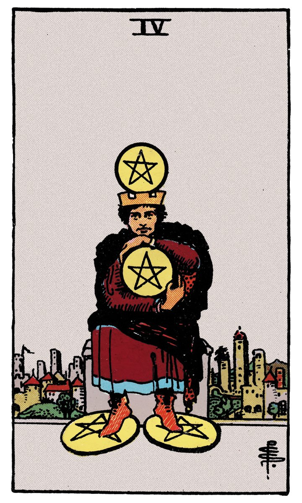
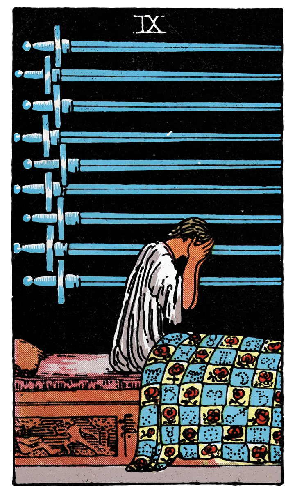
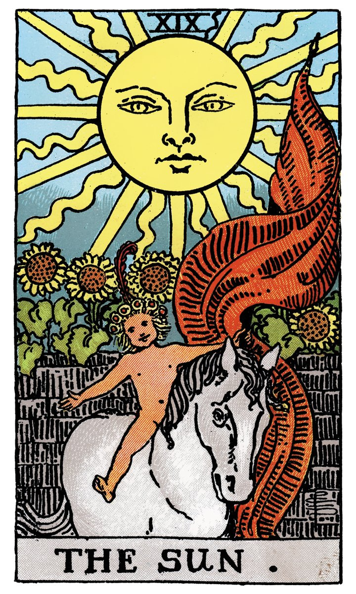
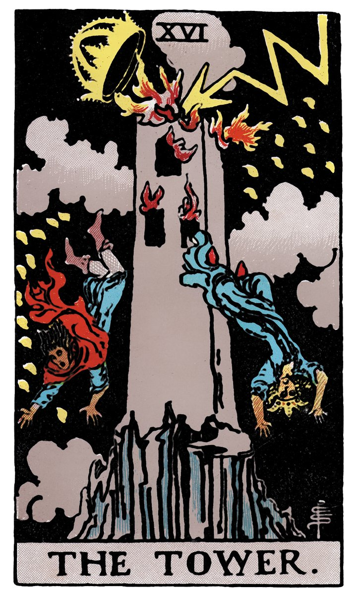

# 模块六｜从单张牌到一个故事

---

## 牌和牌之间，有一条看不见的线

你已经会了关键词联想，会了三牌阵，会把封闭式问题改写成开放式提问。现在你翻开三张牌，脑子里有三个关键词——然后呢？

大多数自学者卡在这一步：三张牌都有了感觉，但就是不知道它们"加起来"在说什么。于是又回到老习惯——翻开书，一张一张查"标准牌意"，最后拼出来的东西，像三句互不相干的句子强行贴在一起。

问题出在方法上。**逐张解释 + 拼凑 = 没有故事。** 塔罗不是用三张牌分别回答三个独立问题，而是用一组图像共同讲述一段流动的叙述。

这个模块要教你的，就是**如何把多张牌变成一段故事**。这是从"读牌"到"读自己"的最后一步，也是最关键的一步。

---

## 方法：找"流动"

故事的本质是**变化**。一个角色从状态A，经历了什么，变成了状态B。塔罗牌阵也一样——从左到右，牌和牌之间一定在发生什么。

你不用分析"这张牌代表什么+那张牌代表什么"，而是问自己一个问题：

> **"从第一张到第三张，发生了什么变化？"**

具体来说，找三个层面的流动：

### 一、情绪的流动

看人物的面部朝向、身体姿态、背景光线：

- 从左到右，人物是越来越有力量，还是越来越疲惫？
- 颜色是越来越明亮，还是越来越暗？
- 画面是越来越复杂，还是越来越简单？

> **例子：** 左边一张牌人物背对画面，中间侧身，右边正面直视——情绪在"转向"：从回避到面对。

### 二、动作的流动

看人物在做什么：

- 从静止到行动？
- 从封闭到开放？
- 从独自一人到多人出现？

> **例子：** 左边一个人坐着不动，中间一个人在走路，右边一群人在庆祝——动作在"加速"：从停滞到投入。

### 三、视角的流动

看画面给你的"距离感"：

- 画面视角越来越近——在深入一个问题的核心
- 画面视角越来越远——在从更大的格局看这件事
- 视角不变——这个问题需要你换个角度

---

## 故事的三段式：起点 → 转折 → 落点

把三个维度的流动串在一起，就形成了一段故事的基本结构：

| 位置 | 叙事功能 | 核心问题 |
|------|----------|----------|
| 第一张 | **起点** | 故事从哪里开始？你现在在哪里？ |
| 第二张 | **转折** | 中间发生了什么？推动力是什么？ |
| 第三张 | **落点** | 故事走向哪里？你有可能到达哪里？ |

注意：这个结构不是"过去→现在→未来"的专利。任何一个三牌阵（身心灵、选择障碍资源）都可以用"起点→转折→落点"来组织故事。

---

## 完整示范：把三张牌变成一个故事

假设你在练习"身—心—灵"牌阵，抽到了这三张牌：

**身位：星币四** | **心位：宝剑九** | **灵位：太阳**
:---:|:---:|:---:
 |  | 
一个铁匠在锻造金属，旁边有四枚金币固定在墙上。画面稳定、专注。 | 一个人坐着，双手抱头，旁边有九把剑挂在墙上。画面沉重、压抑。 | 一个孩子骑在马上，阳光灿烂，周围开满花。画面明亮、轻盈。

逐张看的话，你可能会说："行动上我很稳定——情感上我很焦虑——精神上我在成长"。三句独立的话，拼不到一起。

现在我们用"流动"来看：

**情绪的流动：** 从稳定（身）→ 沉重（心）→ 明亮（灵）。这是一条"先沉下去再升起来"的弧线。

**动作的流动：** 从专注工作（身）→ 陷入思绪（心）→ 骑马上路（灵）。从做 → 想 → 出发。

**视角的流动：** 近景（身）→ 室内近景（心）→ 户外远景（灵）。视角在拉远，格局在变大。

现在把它们串成一段故事：

> *"我在行动上看起来很稳，每天都在认真做事，外界可能看不出什么问题。但真正让我累的，是心里反复在想的事——那些焦虑像深夜醒着脑子里跑马灯一样。不过，我的内心深处其实知道方向在哪。有一种新的力量在生长，它还很年轻，但它想出发。我的身体在干活，心里在焦虑，但灵魂在说——走。"*

这不是在"解牌"，这是在**读自己**。三张牌帮你看到了你内部三个层面之间的张力和方向。

---

## 当牌"对不上"的时候——矛盾是礼物

有时候你会发现，三张牌之间好像互相矛盾。比如左边一张看起来很积极的牌，右边一张看起来很消极的牌。这种时候不要试图"调和"——**矛盾本身就是信息。**

**力量** | **高塔**
:---:|:---:
 | 
温柔地驯服一头狮子——控制、耐心、内在力量 | 一座塔被雷劈中，人们在坠落——崩塌、释放、突如其来的真相

这矛盾吗？表面上矛盾，但串起来可能是一个很有深度的故事：

> *"我一直在用温和的方式控制局面，觉得一切都在掌握中。但有些东西我压得太久了，它们需要被释放。高塔不是灾难——它是那些我一直不敢面对的真相，终于浮出水面了。"*

看到没有？**矛盾不是错误，矛盾是你内心正在发生的事。** 不要回避它，把它写进故事里。

---

## 一个防止"过度解读"的锚

讲故事的时候，你可能会担心："我是不是在瞎编？"

有一个简单的锚可以防止你飘太远：**你讲的故事，必须和牌面上的画面有直接关联。** 如果牌上画的是一个人坐在王座上，你当然可以说"他在思考"、"他在等待"、"他很有权力感"。但你不应该说"他今天早上吃了两个包子"——除非牌面上画了两个包子。

换句话说：**你的联想可以自由，但必须有视觉依据。** 这是"直觉联想"和"纯编故事"之间的那条线。
---

## 练习｜用同一个困扰，把三张牌串成一个故事

1. 用你模块五抽过的三张牌（或者重新洗牌抽一组新的）
2. 观察三张牌之间的"流动"——情绪、动作、视角分别发生了什么变化？
3. 用"起点 → 转折 → 落点"的结构，把三张牌串成一个3-5句的故事
4. 写下来。不要评价自己写得好不好，写下来就是完成

你可以用这个模板：

> **起点（第一张）：** 我现在……
>
> **转折（第二张）：** 但中间有……
>
> **落点（第三张）：** 所以有可能走向……

---

---

## 你已经学会了

从模块一到模块六，你学到的不只是"怎么用塔罗牌"，而是一套完整的自我对话方法：

- **关键词联想法** —— 用姿态、颜色、数字替代死记硬背
- **每日单张牌** —— 用最小的练习建立最大的习惯
- **三牌阵与提问技巧** —— 把封闭式问题改写成开放式探索
- **从单张牌到故事** —— 把图像变成一段关于你自己的叙述

这些方法不需要依赖任何"大师"帮你解读。翻开牌的那一刻，解读权在你手里。

接下来唯一要做的事，就是**持续练下去**。每天抽一张牌，每周做一次三牌阵，偶尔把牌连成故事。不需要完美，不需要每天都有"收获"。只需要翻开牌，看着它，相信你看到的。

**你已经会了。**
